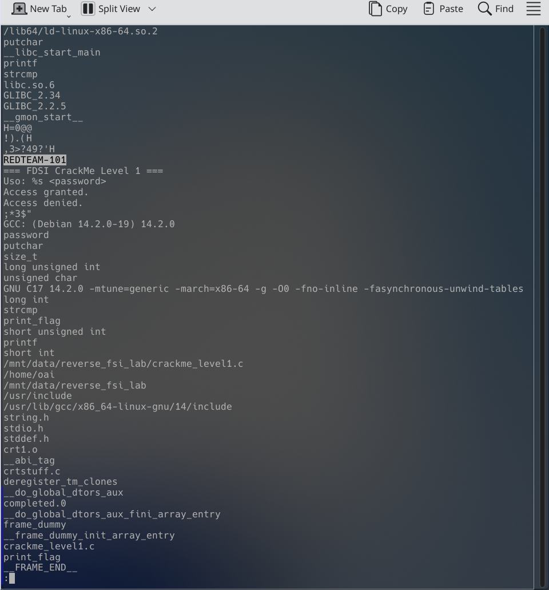
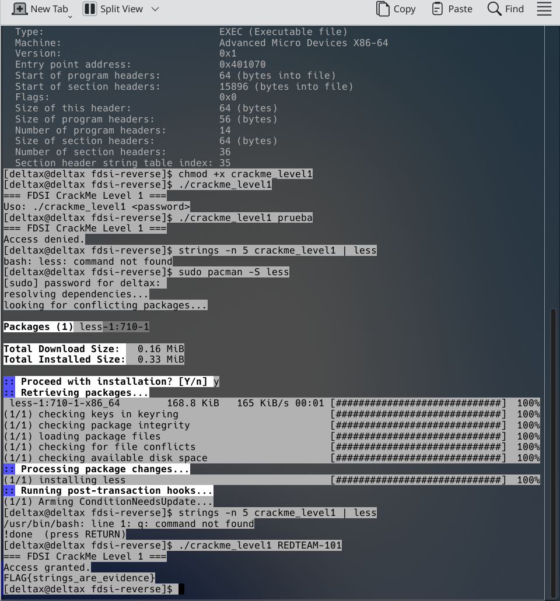

# Nivel 1 — Recon ("Strings are evidence")

**Binario:** `crackme_level1` (ELF64 x86-64, dinámico, no stripped, con `debug_info`)
**SHA-256:** `61e980febe84b1003b5a3b641468e915b984f7fdd835be9828af54233f88c68c` (coincide con el material original)

## 1. Observación inicial
Se ejecutó el programa sin argumentos y con un dato falso, sin asumir nada:

```bash
$ ./crackme_level1
=== FDSI CrackMe Level 1 ===
Uso: ./crackme_level1 <password>

$ ./crackme_level1 prueba
=== FDSI CrackMe Level 1 ===
Access denied.
```

El programa espera un único argumento (`<password>`) y responde con un mensaje de aceptación o rechazo.

## 2. Hipótesis
Por los mensajes `Access granted` / `Access denied` y la importación de `strcmp`,
el programa compara el argumento con una cadena fija. Si esa cadena está embebida en el binario,
`strings` debería mostrarla. Además existe un símbolo `print_flag`, que debería ejecutarse solo en el camino de éxito.

## 3. Evidencia
`strings -n 5 crackme_level1` mostró, entre otras, estas cadenas relevantes:

```text
REDTEAM-101
=== FDSI CrackMe Level 1 ===
Uso: %s <password>
Access granted.
Access denied.
print_flag
strcmp
```

`REDTEAM-101` aparece suelta junto a los mensajes de validación, sin contexto de ayuda ni texto normal del programa: candidata a contraseña.

Se confirmó con `objdump -d -M intel crackme_level1` (función `main`):

| Dirección | Instrucción | Significado |
|---|---|---|
| `4011e7` | `lea rax,[rip+0xe16]  # 402004` | carga la dirección del string embebido en una variable local |
| `401241` | `call strcmp@plt` | compara `argv[1]` con ese string |
| `401246` | `test eax,eax` | ¿`strcmp` devolvió 0 (iguales)? |
| `401248` | `jne 401265` | si son distintos, salta a "Access denied" |
| `401259` | `call print_flag` | si son iguales, imprime la FLAG |

Flujo: `main` → `strcmp(argv[1], "REDTEAM-101")` → si es 0, `print_flag`.

## 4. Resultado
```bash
$ ./crackme_level1 REDTEAM-101
=== FDSI CrackMe Level 1 ===
Access granted.
FLAG{strings_are_evidence}
```

- **Contraseña:** `REDTEAM-101`
- **FLAG:** `FLAG{strings_are_evidence}`

La hipótesis se confirmó sin consultar el código fuente.

## 5. Por qué `strings` puede revelar secretos embebidos
Las constantes de texto del programa (como una contraseña usada en `strcmp`) se guardan tal cual en la sección `.rodata` del ejecutable.
`strings` extrae cualquier secuencia de caracteres imprimibles del archivo, así que basta con leer el binario, sin ejecutarlo,
para ver la clave. Compilar un secreto dentro del programa no lo oculta: solo lo mueve de un archivo de texto a un archivo binario
que cualquiera con acceso al ejecutable puede inspeccionar.

## Capturas


