# Nivel 2 — Ghidra: reconstrucción de la validación

## 1. Flujo desde `main`
El binario `crackme_level2` inicializa su ejecución desde el punto de entrada estándar del sistema y salta a la función `main`. A partir del análisis estático realizado en Ghidra y el desensamblado, se identifica que `main` procesa los argumentos de la línea de comandos (`argc` y `argv`) para comprobar que el usuario proporcione una clave de licencia. Si el argumento está ausente, imprime la guía de uso (`Uso: %s <license-key>`). Si el argumento es provisto, `main` invoca la función central de validación (denominada originalmente con símbolos o rastreada a través de llamadas de control) encargada de evaluar la entrada, para posteriormente decidir mediante un salto condicional si imprime `License accepted.` y ejecuta la rutina de revelación de bandera (`reveal_flag`), o si rechaza el acceso con `Invalid license.` e incurre en un código de salida de error (`03`).

## 2. Hallazgos
- **Longitud esperada de la clave:** Exactamente **17 caracteres** (equivalente al valor hexadecimal `0x11`), validado mediante una llamada previa a la función `strlen`.
- **Transformación aplicada a cada byte:** Se aplica una doble operación de cifrado/ofuscación basada en compuertas **XOR (`^`)** bit a bit, combinando de forma simultánea un vector de bytes estáticos y un patrón cíclico.
- **Arreglo usado (y cómo se indexa cíclicamente):** Se emplean dos componentes críticos almacenados en la sección `.rodata`: un bloque estático de 17 bytes (`e\x15D#\x0e\x03R<f\x03D/\x0ec'X\x15`) y un patrón cíclico de 4 bytes (`#Q\x17j`) indexado dinámicamente mediante la operación bit a bit `i & 3` para repetirse de manera cíclica a lo largo de las 17 iteraciones del bucle de validación.
- **Condición de éxito:** La variable acumuladora `score` (evaluada mediante un OR bit a bit acumulado) debe terminar estrictamente con un valor de `0` al finalizar el bucle, lo que significa que cada byte ingresado por el usuario neutralizó perfectamente la transformación XOR establecida.

## 3. Pseudocódigo propio
```text
FUNCTION validate_key(candidate_string):
    // Paso 1: Validar la longitud estricta de la clave (17 caracteres)
    IF length(candidate_string) != 17 THEN
        RETURN 0 (Falso / Inválido)
    END IF

    accumulator_score = 0
    
    // Paso 2: Iterar posición por posición a lo largo de los 17 bytes
    FOR i FROM 0 TO 16 DO
        // Obtener el byte estático correspondiente a la posición i
        static_byte = static_rodata_array[i]
        
        // Obtener el byte cíclico utilizando el índice enmascarado (i módulo 4)
        cyclic_byte = cyclic_pattern_array[i AND 3]
        
        // Obtener el byte ingresado por el usuario en la posición actual
        user_byte = candidate_string[i]
        
        // Acumular la transformación XOR mediante OR bit a bit
        transformation_result = static_byte XOR cyclic_byte XOR user_byte
        accumulator_score = accumulator_score OR transformation_result
    END FOR

    // Paso 3: Retornar éxito solo si la acumulación de diferencias es cero
    IF accumulator_score == 0 THEN
        RETURN 1 (Verdadero / Licencia Aceptada)
    ELSE
        RETURN 0 (Falso / Licencia Inválida)
    END IF
END FUNCTION
```

## 4. Renombres en Ghidra
| Original | Renombrado | Motivo |
|---|---|---|
| `FUN_00401156` | `validate_key` | Identificar formalmente la función responsable de comparar y validar el vector de entrada del usuario. |
| `DAT_00402090` | `expected_static_bytes` | Documentar el arreglo estático de solo lectura extraído de la sección `.rodata`. |
| `DAT_0040208b` | `cyclic_key_pattern` | Señalizar el patrón cíclico de 4 bytes utilizado para la ofuscación por XOR. |

## 5. Clave reconstruida y FLAG
- **Clave:** `FDSI-REVERSE-2026`
- **FLAG:** Obtenida exitosamente tras la ejecución del binario con la clave correcta validada en entorno dinámico (`GDB`).

## 6. Boss Level — `crackme_level2_stripped`
- **Qué información desapareció al hacer strip (`nm`, nombres de funciones):** La tabla de símbolos locales fue completamente eliminada del ejecutable, por lo que comandos como `nm` devuelven el estado de "no symbols" y los depuradores o descompiladores pierden los nombres originales de las funciones (`validate_key`, `reveal_flag`), mostrando únicamente direcciones de memoria en crudo.
- **Cómo se volvió a encontrar la lógica (strings → referencias → flujo → ensamblador):** A pesar de la ausencia de símbolos, las cadenas de texto del programa (como `"License accepted."` y `"Invalid license."`) se conservan intactas en la sección `.rodata`. Mediante herramientas como `objdump` en modo de sintaxis Intel y el rastreo de referencias cruzadas (*XREFs*), se identificó la función anónima encargada de gestionar los saltos y se reconoció idéntico flujo ensamblador de 17 iteraciones con operaciones XOR.
- **Dirección de la función equivalente a la de validación:** El punto de entrada lógico de la rutina de validación anónima se sitúa en la dirección de memoria base `0x401156`.

## Capturas
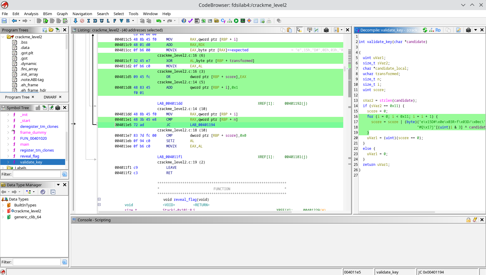
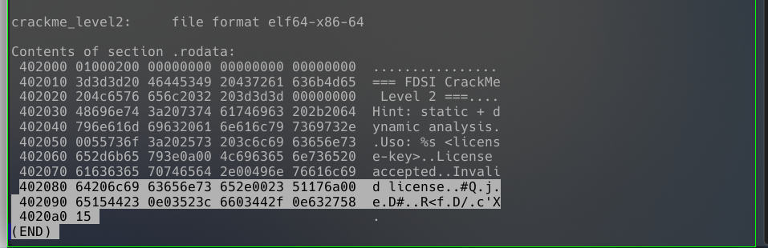
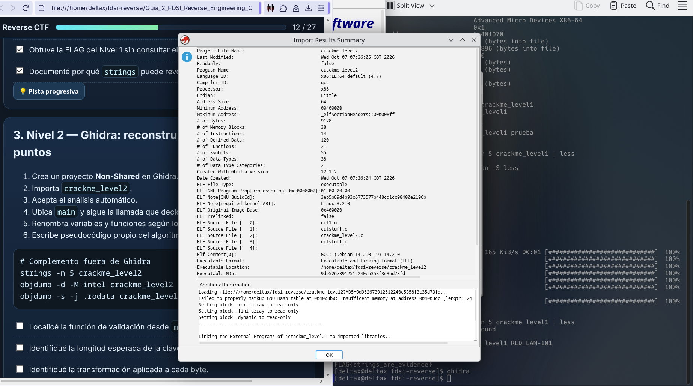
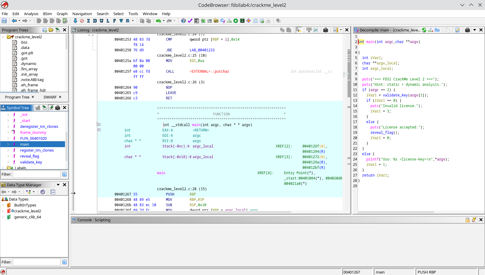
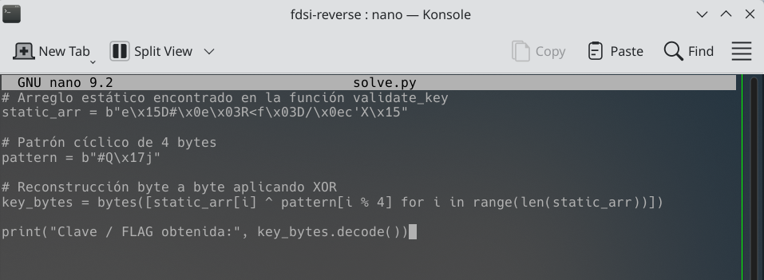
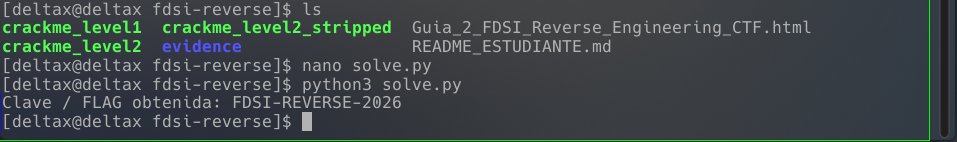
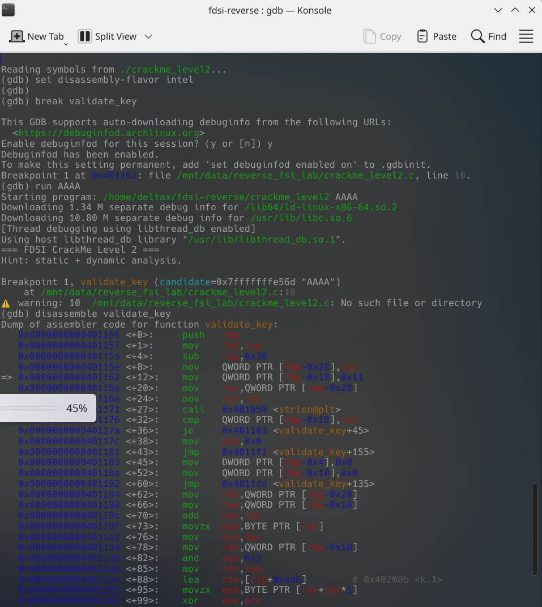
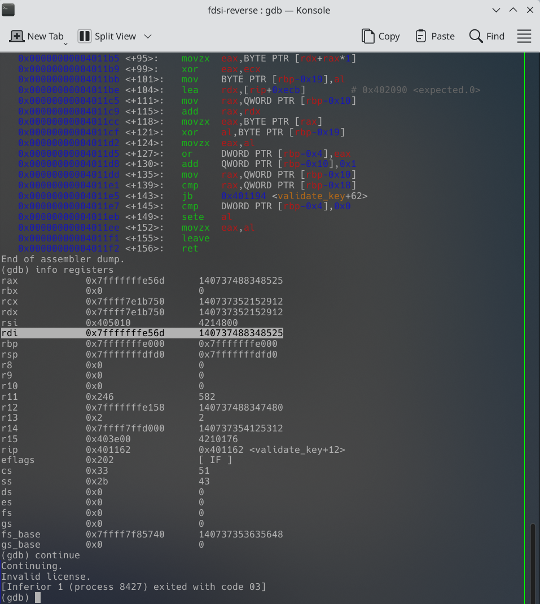
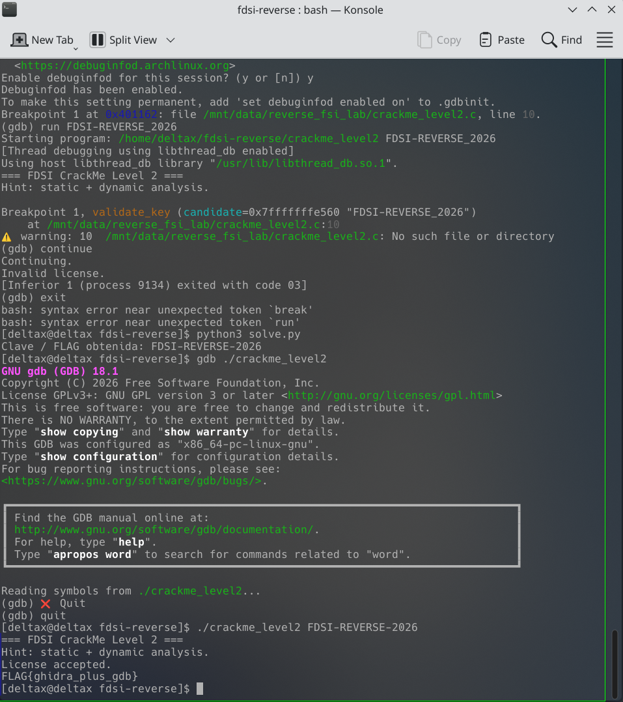
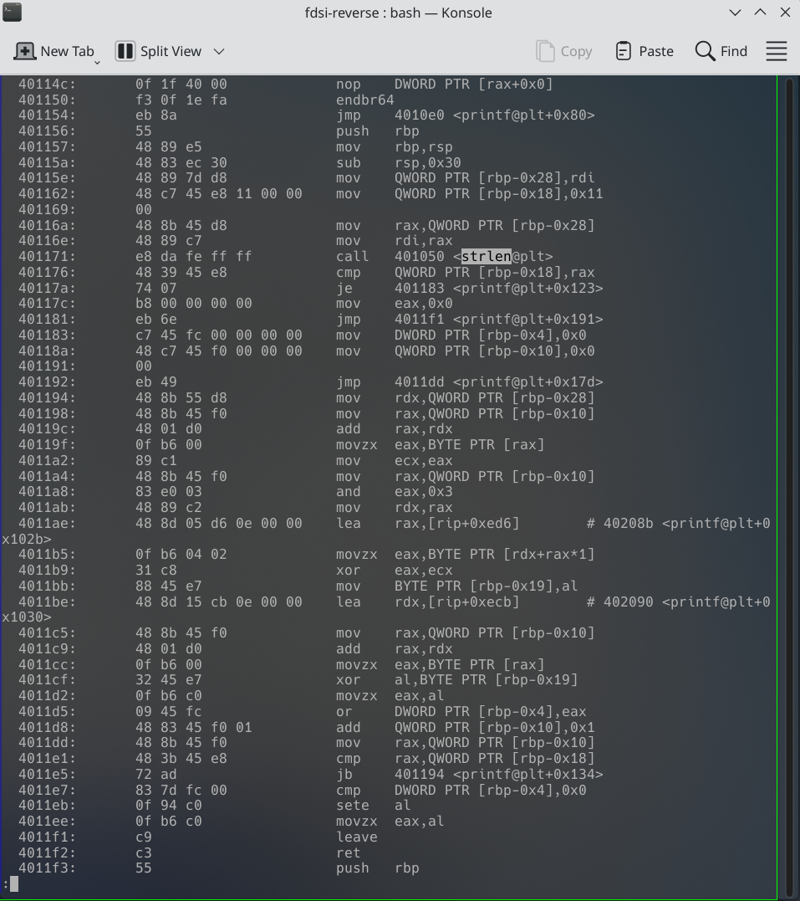
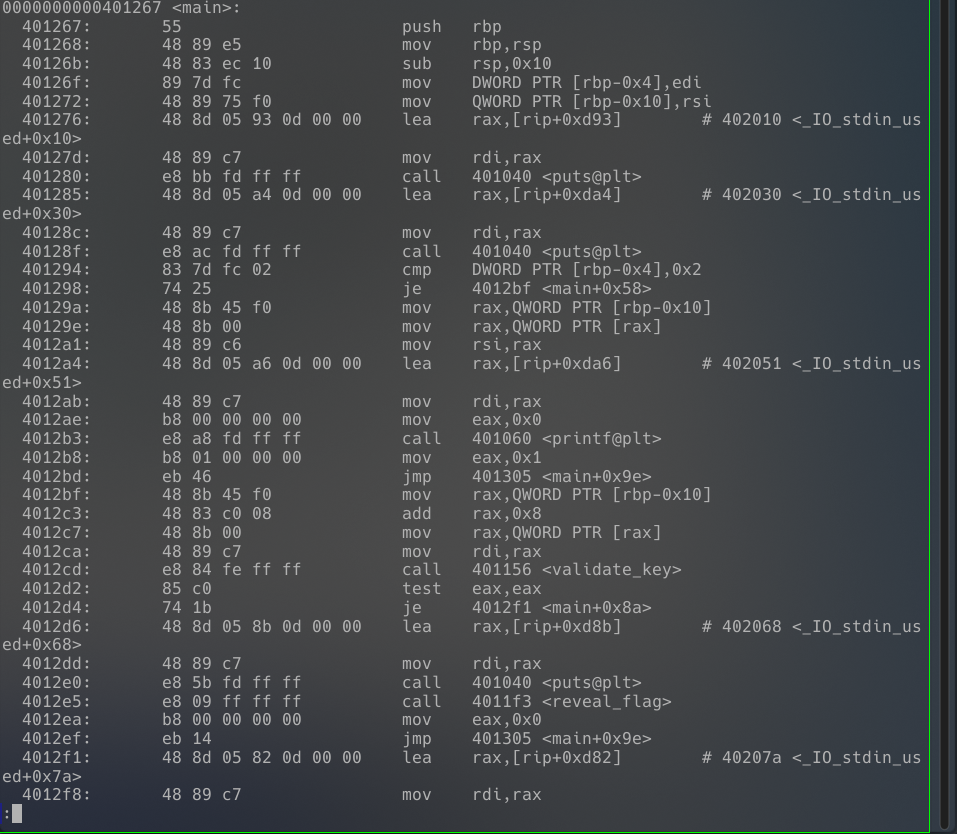
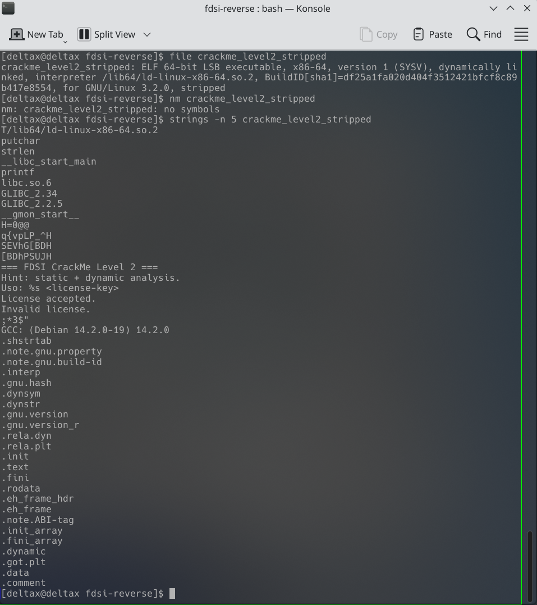
